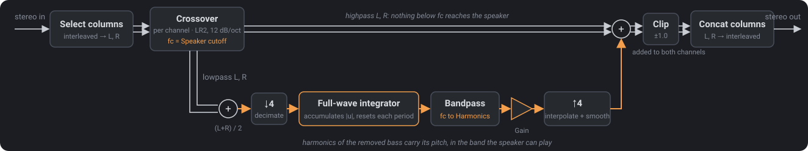

# Phantom Bass

Phantom Bass is a bass enhancer for band-limited speakers: laptops, phones, small Bluetooth speakers, and the RP2040 amplifier it was written for. Such speakers reproduce nothing below a cutoff somewhere between 60 and 300 Hz. Phantom Bass removes the bass below that cutoff and adds harmonics of it in the band the speaker can play. The ear infers the missing fundamental from the harmonics, so the bass line stays audible. It is not a sub-bass generator for full-range systems; set the Speaker Cutoff to the speaker you are playing through.

The algorithm follows the MathWorks example [Psychoacoustic Bass Enhancement for Band-Limited Signals](https://www.mathworks.com/help/audio/ug/psychoacoustic-bass-enhancement-for-band-limited-signals.html).



The repository holds two components in one CMake tree and one nix flake:

| directory | contents |
|---|---|
| [`pbe-dsp/`](pbe-dsp) | C11 static library. Q2.30 fixed point; no float in the per-sample path. Written for the RP2040 (Cortex-M0+) at 48 kHz; portable. |
| [`pbe-plugin/`](pbe-plugin) | VST3 and CLAP plugin. [CPLUG](https://github.com/Tremus/CPLUG) for the formats, [pugl](https://github.com/lv2/pugl) and [NanoVG](https://github.com/memononen/nanovg) for the editor. Linux, Windows (cross-compiled), macOS (untested). |

Parameters: **Speaker Cutoff** (20 to 500 Hz) is the frequency below which the target speaker stops reproducing bass; it places the crossover and the bottom of the harmonics band. **Harmonics** sets the top of the harmonics band. **Gain** sets the enhancement level in dB. Typical cutoffs: 60 Hz for a small bookshelf speaker, 150 to 300 Hz for a laptop, up to 500 Hz for a phone.

Hosts list the plugin under Mastering (VST3 `Fx|Mastering`, CLAP `mastering`) with the keywords `bass-enhancer`, `virtual-bass` and `band-limited-speakers`.

## Build

Use the nix dev shell. It provides the toolchain, Unity and the vendored plugin sources.

```sh
nix develop -c cmake -S . -B build -G Ninja -DBUILD_TESTING=ON -DBUILD_PLUGIN=ON
nix develop -c cmake --build build
nix develop -c ctest --test-dir build --output-on-failure
```

Find the plugin in `build/plugins/PhantomBass.vst3` and `build/plugins/PhantomBass.clap`. Copy them to `~/.vst3/` and `~/.clap/` on Linux.

Build packages (Release builds; tests run in the sandbox):

```sh
nix build                              # plugin for this machine, in result/lib/{vst3,clap}
nix build .#pbe-dsp                    # library and headers
nix build .#pbe-dsp-arm-none-eabi      # library for the RP2040 (-mcpu=cortex-m0)
nix build .#pbe-plugin-x86_64-windows  # Windows plugin, cross-compiled on Linux
nix build .#pbe-plugin-aarch64-linux   # aarch64 Linux plugin, cross-compiled on x86_64-linux
nix flake show                         # list every package for every host
```

Download prebuilt zips from the GitHub Releases page; maintainers, see the release steps in [AGENTS.md](AGENTS.md).

To build without nix, install a C11 compiler, CMake 3.20 or newer, and Unity for the tests. For the plugin, install X11 and GL headers on Linux and pass checkouts of CPLUG, pugl and NanoVG with `-DPBE_CPLUG_DIR=<cplug> -DPBE_PUGL_DIR=<pugl> -DPBE_NANOVG_DIR=<nanovg>`.

## Listen

Run `pbe-tone` to play a test tone through the plugin with the editor open (Linux, ALSA). Press `b` to bypass and raise Gain. Run `analyze.py` to render test signals and plot spectra. See [`pbe-plugin/README.md`](pbe-plugin/README.md) for both tools, the plugin architecture, the threading model and known limitations.

## Acknowledgements

The algorithm follows the MathWorks example above. The plugin uses CPLUG (Tré Dudman), pugl (David Robillard), NanoVG (Mikko Mononen) and the CLAP API (Alexandre Bique), and embeds DejaVu Sans. See [THIRD-PARTY.md](THIRD-PARTY.md).

## License

MIT. See [LICENSE](LICENSE). See [THIRD-PARTY.md](THIRD-PARTY.md) for third-party licenses and the VST3 SDK note.
